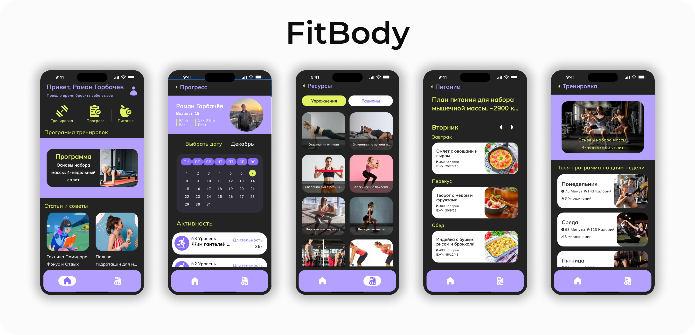

# FitnessApp

## Description

**FitnessApp** is a modern Android application designed to help users stay active and track their fitness progress through a personalized setup flow.  
The app is built with a strong focus on **Clean Architecture** and **MVVM**, ensuring scalability, testability, and clear separation of concerns.  
It provides a dynamic onboarding process, user data management, and integration with cloud databases for real-time data synchronization.

Depending on the branch:
- **master** → uses **Firebase** (NoSQL)  
- **sibd** → uses **Supabase** (PostgreSQL)

## Features

- User onboarding with customizable setup flow (gender, age, and goals)  
- Local data caching with **Room**  
- Cloud synchronization with **Firebase** or **Supabase**  
- Image upload and retrieval from cloud storage  
- Clean navigation using **Jetpack Compose Navigation**  
- Application of **SOLID**, **KISS**, and **DRY** principles for maintainable and scalable code  

## Tech Stack

- **Kotlin**  
- **Jetpack Compose** — declarative UI  
- **MVVM + Clean Architecture**  
- **Hilt** — dependency injection  
- **Coroutines & Flow** — asynchronous and reactive processing  
- **Room** — local data storage  
- **Firebase / Supabase** — cloud database and storage  
- **Material 3** — modern Android design system  

## Architecture Overview

The app is structured with a clear separation of layers:
- **UI Layer (Compose)** — presents data reactively from the ViewModel  
- **Domain Layer** — contains **use cases** that encapsulate business logic  
- **Data Layer** — handles repositories, data sources, and mapping between entities  

This structure provides a clean and maintainable project that adheres to modern Android development standards.

## Future Improvements

Planned enhancements to make the app more interactive and user-friendly:
- **Push Notifications** — personalized reminders for workouts and achievements  
- **Community Section** — connect with other users, share goals, and progress  
- **Support Chat** — real-time communication with fitness experts or app support  
- **Workout Analytics** — detailed progress tracking and statistics  
- **Music Sync Mode** — adaptive lighting and visuals reacting to music rhythm (DMX integration)

## Design

  

